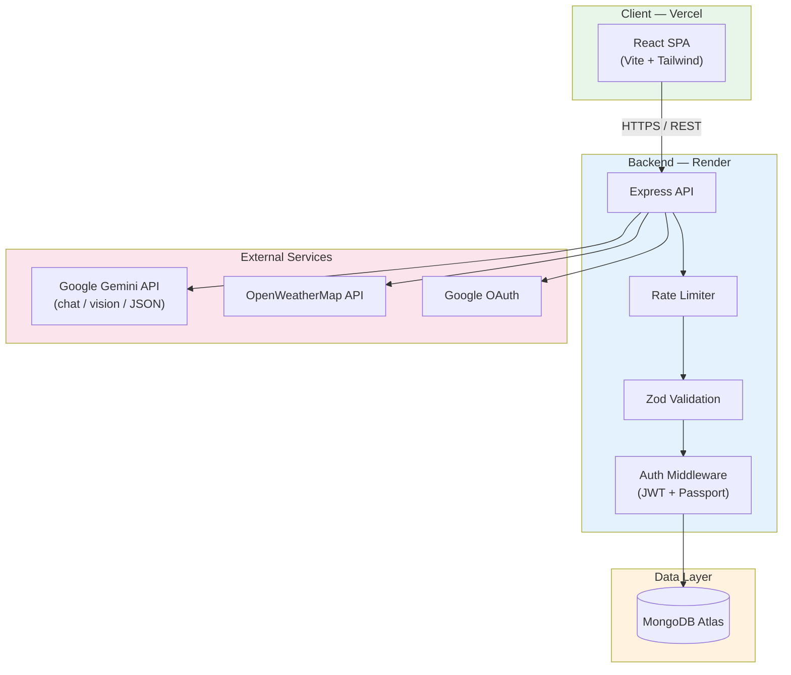
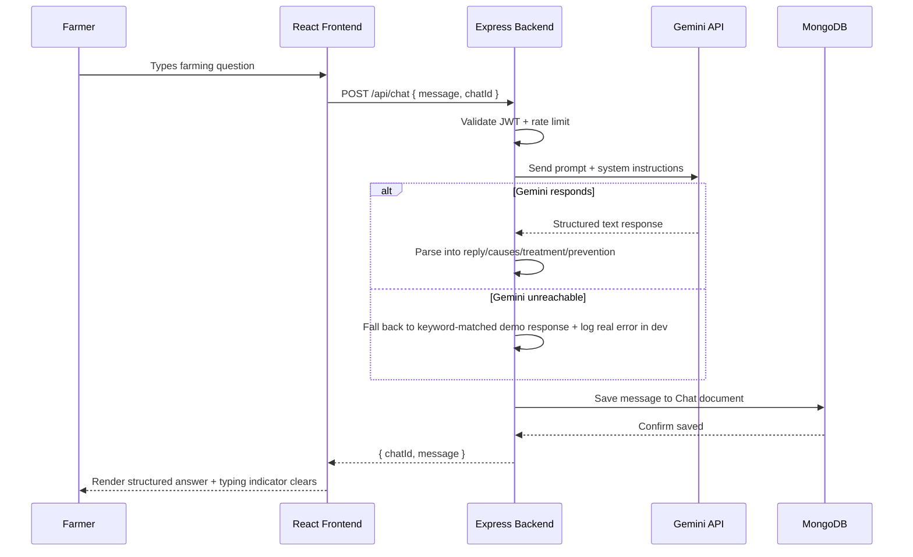
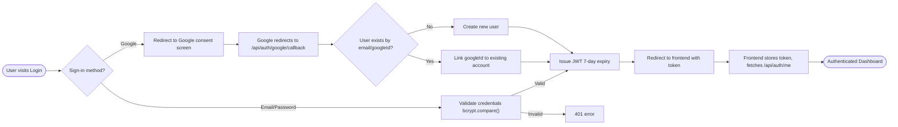

# 🌱 AgriAI Advisory System

A full-stack AI-powered agricultural advisory platform that gives Indian farmers instant access to expert-level crop guidance — through text chat, voice, and photo-based disease detection — in one place.

---

## 📋 Table of Contents

- [Problem Statement](#-problem-statement)
- [Solution](#-solution)
- [Key Features](#-key-features)
- [Advantages](#-advantages)
- [Tech Stack](#-tech-stack)
- [System Architecture](#-system-architecture)
- [Request Flow — AI Advisory Chat](#-request-flow--ai-advisory-chat)
- [Authentication Flow](#-authentication-flow)
- [Project Structure](#-project-structure)
- [Getting Started](#-getting-started)
- [Environment Variables](#-environment-variables)
- [Deployment](#-deployment)
- [API Overview](#-api-overview)
- [Known Limitations](#-known-limitations)

---

## 🎯 Problem Statement

Smallholder and mid-sized farmers across India often lack timely access to expert agricultural advice. A farmer who spots an unfamiliar disease on a tomato plant, or wants to know the right crop for their soil this season, typically has to:

- Wait for a local agricultural extension officer to become available
- Travel to a Krishi Vigyan Kendra (agricultural science center)
- Rely on word-of-mouth or guesswork, risking crop loss from delayed or incorrect treatment

Meanwhile, government schemes and subsidies that could directly help them often go unused simply because farmers don't know they exist or can't easily check eligibility.

## ✅ Solution

AgriAI closes that gap with a single platform that puts an AI advisor in every farmer's pocket:

- **Ask a question in plain language** and get a structured answer — causes, treatment, and prevention — in seconds, not days
- **Photograph a diseased leaf** and get an AI-powered diagnosis with confidence scoring and remedies
- **Speak instead of type** — the assistant listens, transcribes, and reads its answer back aloud, lowering the barrier for users less comfortable typing
- **Check real weather** for their exact location (via device GPS or search) with farming-specific recommendations, not generic forecasts
- **Discover relevant government schemes** they may be eligible for, searchable in one place
- **Admins get a real operational dashboard** — user management, chat logs, and reporting — so the platform is actually maintainable, not just a demo

## ✨ Key Features

| Category | Features |
|---|---|
| **AI Advisory** | Conversational chat with multi-turn context, structured causes/treatment/prevention output, animated typing indicator |
| **Disease Detection** | Photo upload → AI vision analysis → disease name, confidence score, severity, causes, remedies |
| **Voice Assistant** | Real browser-based speech-to-text input, AI response read aloud via speech synthesis |
| **Crop & Soil Advisory** | Soil-type and season-based crop recommendations; soil health analysis from NPK/pH values |
| **Weather** | Real-time weather via OpenWeatherMap, device geolocation or manual city search, farming-specific alerts |
| **Government Schemes** | Searchable directory of central schemes with eligibility, benefits, and deadlines |
| **Auth** | Email/password with bcrypt hashing, JWT sessions, Google OAuth, OTP-based password reset |
| **Admin Panel** | Full user CRUD, chat log inspection, real MongoDB-aggregated reports (query trends, user growth, disease breakdowns) |
| **Personalization** | Bookmarks across chat/disease/crop/soil results, notification preferences, saved profile details |

## 🌟 Advantages

- **Accessible by design** — voice input means literacy or typing comfort isn't a barrier to using the AI features
- **Structured, actionable output** — not a wall of AI text; causes/treatment/prevention are visually distinct so a farmer can act on it quickly
- **Real backend, not a prototype** — every feature reads and writes to a real database with proper validation, rate limiting, and error handling, not mock data pretending to be functional
- **Graceful degradation** — if the Gemini API or weather API is unreachable, the app falls back to sensible demo data instead of a broken UI, and surfaces the real error in dev logs rather than hiding it
- **Admin-manageable** — this isn't just a farmer-facing tool; it's operable day-to-day by whoever runs the platform

## 🛠 Tech Stack

**Frontend**
- React 19 + Vite
- Tailwind CSS
- React Router v7
- Recharts (admin analytics)
- Web Speech API (voice input/output)

**Backend**
- Node.js + Express
- MongoDB + Mongoose
- JWT + Passport.js (Google OAuth)
- bcrypt (password hashing)
- Zod (request validation)
- express-rate-limit

**AI & External APIs**
- Google Gemini (chat, vision-based disease detection, crop/soil recommendations)
- OpenWeatherMap (current + 5-day forecast)

**Deployment**
- Frontend: Vercel
- Backend: Render
- Database: MongoDB Atlas

---

## 🏗 System Architecture



## 🔄 Request Flow — AI Advisory Chat



## 🔐 Authentication Flow



---

## 📁 Project Structure

```
agriai-complete/
├── README.md
├── PROMPTS.md                    # AI prompt design & testing log
│
├── backend/
│   ├── config/
│   │   └── index.js               # Centralized env config
│   ├── src/
│   │   ├── app.js                 # Express app setup, middleware, routes
│   │   ├── server.js              # Entry point, DB connection, graceful shutdown
│   │   ├── config/
│   │   │   └── passport.js        # Google OAuth strategy
│   │   ├── controllers/
│   │   │   ├── authController.js      # Register, login, OTP reset, profile
│   │   │   ├── chatController.js      # AI chat CRUD
│   │   │   ├── diseaseController.js   # Image analysis
│   │   │   ├── adminController.js     # Admin stats, users, reports
│   │   │   ├── contactController.js   # Contact form
│   │   │   └── featureControllers.js  # Weather, crop, soil, notifications, bookmarks, schemes
│   │   ├── middleware/
│   │   │   ├── auth.js            # JWT verification, role restriction
│   │   │   ├── errorHandler.js
│   │   │   └── logger.js
│   │   ├── models/
│   │   │   ├── User.js
│   │   │   ├── Chat.js
│   │   │   ├── DiseaseResult.js
│   │   │   ├── Bookmark.js
│   │   │   ├── Notification.js
│   │   │   ├── PasswordResetOtp.js
│   │   │   ├── ContactMessage.js
│   │   │   └── index.js
│   │   ├── routes/
│   │   │   ├── auth.js
│   │   │   ├── chat.js
│   │   │   ├── disease.js
│   │   │   ├── admin.js
│   │   │   ├── contact.js
│   │   │   └── features.js
│   │   ├── services/
│   │   │   ├── geminiService.js   # All Gemini API calls + fallbacks
│   │   │   ├── weatherService.js  # OpenWeatherMap integration
│   │   │   └── emailService.js    # OTP email (dev console fallback)
│   │   ├── utils/
│   │   │   ├── db.js
│   │   │   ├── response.js
│   │   │   └── seed.js
│   │   └── validators/
│   │       └── authValidators.js  # Zod schemas
│   ├── package.json
│   └── .env.example
│
└── frontend/
    ├── src/
    │   ├── App.jsx                 # Route definitions
    │   ├── main.jsx
    │   ├── pages/
    │   │   ├── Dashboard.jsx
    │   │   ├── Chat.jsx / ChatHistory.jsx
    │   │   ├── DiseaseDetection.jsx
    │   │   ├── VoiceAssistant.jsx
    │   │   ├── CropRecommendation.jsx / SoilHealth.jsx
    │   │   ├── Weather.jsx
    │   │   ├── GovernmentSchemes.jsx
    │   │   ├── Analytics.jsx / Bookmarks.jsx / NotificationCenter.jsx
    │   │   ├── Profile.jsx / Settings.jsx
    │   │   ├── Landing.jsx / About.jsx / Contact.jsx
    │   │   ├── auth/               # Login, Register, ForgotPassword, OAuthCallback
    │   │   ├── admin/               # AdminDashboard, AdminUsers, AdminChats, AdminReports
    │   │   └── static/              # HelpCenter, PrivacyPolicy, TermsConditions
    │   ├── components/
    │   │   ├── ui/                  # Button, Input, Modal, Toast, Badge, EmptyState...
    │   │   ├── feature/              # ChatBubble, WeatherCard, StatsCard...
    │   │   ├── layout/               # Sidebar, Topbar, Navbar, Footer...
    │   │   ├── ErrorBoundary.jsx
    │   │   ├── GoogleAuthButton.jsx
    │   │   └── ProtectedRoute.jsx
    │   ├── context/
    │   │   ├── AuthContext.jsx
    │   │   ├── BookmarksContext.jsx
    │   │   ├── ThemeContext.jsx
    │   │   └── ToastContext.jsx
    │   ├── hooks/
    │   │   ├── useSpeechRecognition.js
    │   │   └── useSpeechSynthesis.js
    │   ├── layouts/
    │   │   ├── DashboardLayout.jsx  # Wraps pages with per-route ErrorBoundary
    │   │   ├── AdminLayout.jsx
    │   │   ├── AuthLayout.jsx
    │   │   └── PublicLayout.jsx
    │   ├── services/
    │   │   └── aiService.js         # AI feature API calls + offline fallbacks
    │   └── utils/
    │       ├── api.js               # Shared authenticated fetch client
    │       └── helpers.js
    ├── package.json
    └── .env.local
```

---

## 🚀 Getting Started

### Prerequisites
- Node.js ≥ 18
- MongoDB (local or Atlas)
- API keys: Google Gemini, OpenWeatherMap (both free tier)

### 1. Backend
```bash
cd backend
npm install
cp .env.example .env
# Fill in MONGODB_URI, JWT_SECRET, GEMINI_API_KEY, WEATHER_API_KEY (see table below)
npm run dev       # http://localhost:5000
```

### 2. Frontend
```bash
cd frontend
npm install --legacy-peer-deps
npm run dev       # http://localhost:5173
```

> `--legacy-peer-deps` is needed because `lucide-react` hasn't formally declared React 19 support yet in the pinned version — it works fine in practice.

---

## 🔑 Environment Variables

### Backend (`backend/.env`)

| Variable | Required | Description |
|---|---|---|
| `PORT` | No | Defaults to `5000` |
| `NODE_ENV` | No | `development` or `production` |
| `MONGODB_URI` | Yes | MongoDB connection string |
| `JWT_SECRET` | Yes | Long random string |
| `JWT_EXPIRES_IN` | No | Defaults to `7d` |
| `GEMINI_API_KEY` | For AI features | From Google AI Studio |
| `WEATHER_API_KEY` | For weather | From OpenWeatherMap |
| `FRONTEND_URL` | Yes | Your deployed frontend URL (used for CORS + OAuth redirects) |
| `GOOGLE_CLIENT_ID` / `GOOGLE_CLIENT_SECRET` / `GOOGLE_CALLBACK_URL` | For Google OAuth | From Google Cloud Console |

### Frontend (`frontend/.env.local`)

| Variable | Description |
|---|---|
| `VITE_API_URL` | Your backend's API base URL, e.g. `https://your-backend.onrender.com/api` |

---

## ☁️ Deployment

| | URL |
|---|---|
| **Live Frontend** | `<ADD YOUR VERCEL URL HERE, e.g. https://agriai.vercel.app>` |
| **Live Backend** | `<ADD YOUR RENDER URL HERE, e.g. https://agriai-backend.onrender.com>` |

**Frontend** — deployed on Vercel: root directory `frontend`, build command `npm run build`, output directory `dist`, with `VITE_API_URL` pointed at the Render backend.

**Backend** — deployed on Render: root directory `backend`, build command `npm install`, start command `npm start`, connected to a MongoDB Atlas cluster.

### Known limitations on free tier
- **Render's free tier spins down after 15 minutes of inactivity.** The first request after idle takes roughly 30–60 seconds to respond while the server wakes up — this is expected, not a bug. Subsequent requests are fast until it idles again.
- **MongoDB Atlas free tier (M0)** caps at 512MB storage and shared compute — fine for demo/evaluation use, not production scale.
- **OpenWeatherMap free tier** allows ~1,000 calls/day / 60 calls/minute — sufficient for individual use, not high-traffic production.
- **Password reset emails are not actually sent** in this deployment — no email provider (SMTP/SendGrid/SES) is configured. In development, the OTP is logged to the backend's server console instead of emailed; in production this endpoint returns an explicit error rather than silently failing, by design.

---

## 📡 API Overview

| Method | Endpoint | Description |
|---|---|---|
| POST | `/api/auth/register` | Create account |
| POST | `/api/auth/login` | Email/password login |
| GET | `/api/auth/google` | Start Google OAuth flow |
| POST | `/api/auth/forgot-password` → `/verify-otp` → `/reset-password` | 3-step password reset |
| POST | `/api/chat` | Send message, get AI advisory response |
| GET | `/api/chat` | List conversation history |
| POST | `/api/disease-detection` | Upload image for AI diagnosis |
| POST | `/api/crop-recommendation` | Get crop suggestions |
| POST | `/api/soil-health` | Analyze soil test values |
| GET | `/api/weather` | Current weather + forecast (by city, coordinates, or profile default) |
| GET | `/api/schemes` | Search government schemes |
| GET/POST/PATCH/DELETE | `/api/bookmarks` | Bookmark CRUD |
| GET/PATCH/DELETE | `/api/admin/users` | Admin user management |
| GET | `/api/admin/reports` | Real aggregated analytics (query trends, growth, disease breakdown) |

Full route definitions live in `backend/src/routes/`.

---

## ⚠️ Known Limitations

Being upfront about what this project doesn't yet do:

- No automated test suite (unit/integration/e2e)
- No CI/CD pipeline — deploys are manual pushes to Render/Vercel
- Disease detection images are analyzed but not persisted — history shows results, not the original photo
- JWT logout is stateless — a token remains technically valid until natural expiry, even after logout
- No formal responsive-breakpoint audit or performance/re-render profiling has been completed
